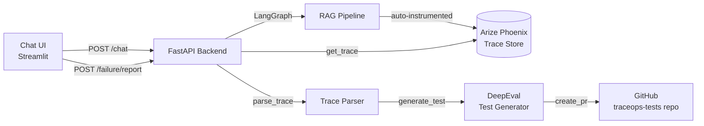

# TraceOps Lite

> Production AI failures should become regression tests automatically.

TraceOps Lite is an AI reliability platform that captures failed LLM interactions in production, retrieves the execution trace, classifies the failure, generates a DeepEval regression test, and automatically opens a GitHub pull request.

Instead of manually debugging hallucinations and stale-context issues repeatedly, TraceOps converts real failures into permanent automated tests.

---

# The Problem

LLM systems fail in production constantly.

Teams usually:
- notice failures manually
- inspect traces manually
- patch prompts manually
- never create regression tests

The same failures silently recur weeks later.

Traditional software engineering solved this problem years ago with CI/CD and automated regression testing.

LLM systems still largely lack this feedback loop.

TraceOps Lite closes that gap.

---

# How It Works

A user flags a bad AI response with a 👎 click.

TraceOps then:
1. captures the trace ID
2. retrieves execution spans from Phoenix
3. parses retrieval + generation behavior
4. classifies the failure type
5. generates a DeepEval regression test
6. commits the test to GitHub
7. opens a pull request automatically

The production failure becomes a permanent regression test.

---

# End-to-End Flow

```text
User asks question
        ↓
RAG chatbot responds
        ↓
User clicks 👎
        ↓
/failure/report webhook
        ↓
Fetch trace from Phoenix
        ↓
Parse spans + classify failure
        ↓
Generate DeepEval regression test
        ↓
Create Git branch + commit test
        ↓
Open GitHub Pull Request
```

---

# Architecture



---

# Tech Stack

## Backend
- FastAPI
- LangGraph
- LangChain
- OpenRouter
- FAISS
- SentenceTransformers

## Observability
- Arize Phoenix
- OpenTelemetry
- OpenInference

## Evaluation
- DeepEval

## Automation
- PyGithub

## Frontend
- Streamlit

## Infrastructure
- Docker
- Docker Compose
- uv

---

# Quick Start

```bash
git clone https://github.com/yourusername/traceops-lite.git
cd traceops-lite

cp .env.example .env

docker compose up --build
```

---

# Local URLs

| Service | URL |
|---|---|
| FastAPI Docs | http://localhost:8000/docs |
| Streamlit Frontend | http://localhost:8501 |
| Phoenix Dashboard | http://localhost:6006 |

---

# Demo Flow

1. Ask the chatbot a question
2. Receive an incorrect or stale answer
3. Click 👎 in the UI
4. Watch the backend generate a regression test automatically
5. Observe a GitHub PR appear with the generated test

---

# Example Generated Regression Test

```python
@pytest.mark.regression
def test_regression_f443ff45():
    test_case = LLMTestCase(
        input="How many PTO days do contractors receive?",
        actual_output="Contractors receive 20 days...",
        retrieval_context=[...],
    )

    metric = FaithfulnessMetric(threshold=0.8)

    assert_test(test_case, [metric])
```

---

# Why DeepEval Instead of assert output == expected?

Traditional regression tests rely on exact string equality.

LLM systems cannot.

Two differently worded responses may both be correct.

TraceOps uses semantic evaluation metrics like:
- HallucinationMetric
- FaithfulnessMetric
- AnswerRelevancyMetric

This enables regression testing for probabilistic AI systems.

---

# Limitations

This is an MVP designed to demonstrate the architecture and feedback loop.

Current limitations:
- trace_id propagation can fail across async boundaries
- Phoenix API paths may vary by deployment/version
- failure classification is heuristic-based
- no persistent database for pipeline history
- GitHub branch collisions are minimally handled
- generated tests may require human review before merge

These tradeoffs were intentionally accepted to optimize for clarity and speed of iteration.

---

# What I’d Build Next

## Product
- Slack notifications when PRs open
- reviewer assignment automation
- failure analytics dashboard
- batch replay of historical traces

## AI Reliability
- LLM-based failure classification
- retrieval quality scoring
- automated root-cause analysis
- semantic diffing between traces

## Infrastructure
- Redis/Celery task queue
- Postgres persistence layer
- multi-tenant architecture
- Kubernetes deployment

---

# Repository Structure

```text
traceops-lite/
├── traceops/
│   ├── api/
│   ├── chatbot/
│   ├── tracing/
│   ├── eval/
│   ├── github_automation/
│   └── core/
├── frontend/
├── tests/
├── Dockerfile
├── docker-compose.yml
└── README.md
```

---

# Why This Project Exists

AI teams need the equivalent of:
- CI/CD
- observability
- regression testing
- production debugging

for LLM systems.

TraceOps Lite is an attempt to make production AI failures measurable, reproducible, and testable.

---

# License

MIT